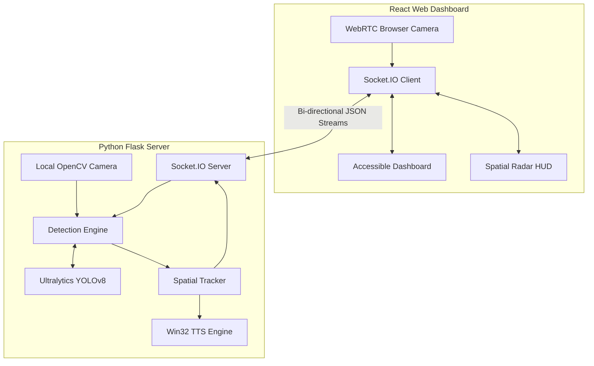
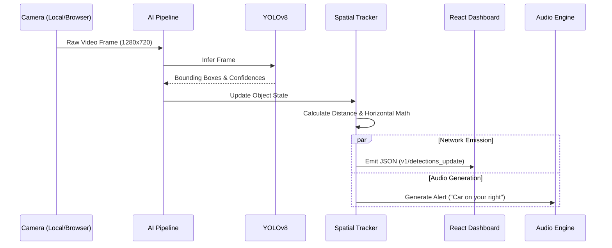

<h1 align="center">Smart Vision Assistant 👁️</h1>

  <em>An AI-powered real-time object detection and scene-understanding system designed to help visually impaired individuals navigate the world safely and independently.</em>

## 🌟 Overview

Smart Vision Assistant acts as a digital pair of eyes, constantly analyzing the user's surroundings using a live camera feed. By combining state-of-the-art **YOLOv8** object detection with real-time **Text-to-Speech (TTS)** and an accessible **React Dashboard**, it delivers immediate, life-saving spatial awareness.

> [!TIP]
> The system is heavily optimized to run locally for maximum privacy and ultra-low latency, but also fully supports a **Cloud WebRTC Mode** for remote browser processing.

---

## 🏗️ System Architecture

The application utilizes a highly optimized dual-node architecture, carefully isolating the heavy AI inference engine from the reactive frontend dashboard to ensure zero UI stutter.

---

## 🔄 Inference Data Flow

To ensure real-time responsiveness (30+ FPS), the backend processes frames entirely asynchronously:

---

## ✨ Key Features

- **Real-Time Object Detection**: High-speed, high-accuracy inference capable of detecting dozens of distinct object classes simultaneously.
- **Spatial Audio Guidance**: The engine calculates exact distance ratios and horizontal coordinates, delivering highly accurate directional audio cues.
- **Collision Avoidance System**: Urgent warnings trigger automatically when objects aggressively breach the 1.0m safety threshold (*"Watch out! Stop!"*).
- **Dynamic Spatial Radar**: A beautiful, real-time UI radar plotting exact relative object positions with smart collision-resolution between dots.
- **Advanced Developer Tools**: View raw JSON socket payloads in real-time, monitor inference latency, and inspect camera framing directly from the UI.

> [!IMPORTANT]
> The system requires a Python 3.8+ environment, Node.js v14+, and a working webcam.

---

## 🚀 Getting Started

### Backend Setup
1. Navigate to the `backend` directory.
2. Create a virtual environment: `python -m venv venv`
3. Activate the environment:
   - Windows: `venv\Scripts\activate`
   - macOS/Linux: `source venv/bin/activate`
4. Install dependencies: `pip install -r requirements.txt`
5. Start the AI Server: `python app.py`

### Frontend Setup
1. Navigate to the `frontend` directory.
2. Install packages: `npm install`
3. Start the dashboard: `npm start`
4. The dashboard will automatically launch at `http://localhost:3000`.
